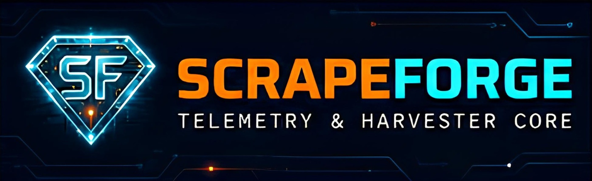

<div align="center">

# 🛡️ SCRAPEFORGE
### Local-First Harvester Core



<p align="center">
  
  
  
  <a href="https://github.com/luckyandeee/scrapeforge/releases/latest"></a>
</p>

**Open Source Web Automation Utility**

</div>

---

## ⚖️ Legal & Compliance Disclaimer
**ScrapeForge is provided as a local-only, client-side browser automation utility for educational, research, and personal use.** 

By downloading or using this software, you acknowledge:
1. **User as Sole Data Fiduciary:** This software operates entirely on your local machine. It does not send, sync, or transmit any extracted data to remote servers or the developers. You assume 100% legal responsibility for ensuring your data collection complies with all applicable privacy laws (including India's DPDP Act, GDPR, and CCPA).
2. **Terms of Service:** You are solely responsible for ensuring your use complies with the Terms of Service, `robots.txt` directives, and acceptable use policies of any target website. 
3. **Account Risk & Zero Liability:** Automated web extraction can result in IP blocks or account suspensions. The authors accept absolutely no liability for any damages, legal repercussions, or account bans arising from the use of this software. **USE AT YOUR OWN RISK.**

---

## 📡 System Overview
ScrapeForge is an open-source, local-first desktop application designed for autonomous data extraction. It utilizes a robust client-side architecture, leveraging local machine hardware for high-speed deterministic extraction and SQLite caching, ensuring 100% of your data stays on your machine.

## ⚡ Core Capabilities

*   **Local-First Architecture:** Operates with an embedded local SQLite database for real-time buffering and high-speed local queries. No forced cloud syncs, no telemetry.
*   **High-Speed Extraction Vectors:** Deploys structured, deterministic web spiders and DOM parsers to harvest open web directories without relying on third-party API tokens.
*   **Hardware-Gated Installation:** Custom installer scripts verify system capabilities (minimum 64-bit architecture and 4 CPU cores) prior to deployment to prevent hardware overload.
*   **Data Portability:** Instantly export active vectors to beautifully formatted PDF reports or Excel-safe CSV manifests locally.

---

## 📥 Direct Downloads

Get the latest stable release of ScrapeForge directly for your operating system:

| Platform | Direct Download Link | Target Architecture |
| :--- | :--- | :--- |
| **Windows** (.exe) | [Download for Windows](https://github.com/luckyandeee/scrapeforge/releases/latest/download/ScrapeForge-Windows.exe) | x64 (64-bit) |
| **macOS** (.dmg) | [Download for Mac](https://github.com/luckyandeee/scrapeforge/releases/latest/download/ScrapeForge-macOS.dmg) | Apple Silicon / Intel |
| **Linux** (.AppImage) | [Download for Linux](https://github.com/luckyandeee/scrapeforge/releases/latest/download/ScrapeForge-Linux.AppImage) | x64 |

---

## 🛠️ Technical Stack

**Frontend / UI:**
*   React 18 + Vite
*   TypeScript
*   Tailwind CSS (Custom Cyber-Aesthetic Theme)
*   Lucide React (Iconography)

**Backend / Core:**
*   Electron (Desktop Engine)
*   Node.js (Internal Routing & Automation)
*   Playwright / Cheerio (Headless Extraction)

**Data Layer:**
*   Local Caching: SQLite (No remote databases)

---

## ⚙️ Development & Build Setup

### Prerequisites
*   Node.js (v18+)
*   Git
*   Minimum hardware for testing: 4-Core CPU, 64-bit OS.

### Initialization & Separate Execution
```bash
# Clone the repository
git clone [https://github.com/luckyandeee/scrapeforge.git](https://github.com/luckyandeee/scrapeforge.git)

# Navigate into the project directory
cd scrapeforge

# Install root/backend dependencies
npm install

# --- RUNNING SEPARATELY ---

# 1. Start the Backend / Electron Engine core
npm run dev:backend

# 2. Open a separate terminal window and start the Frontend (React + Vite matrix)
cd frontend
npm install
npm run dev